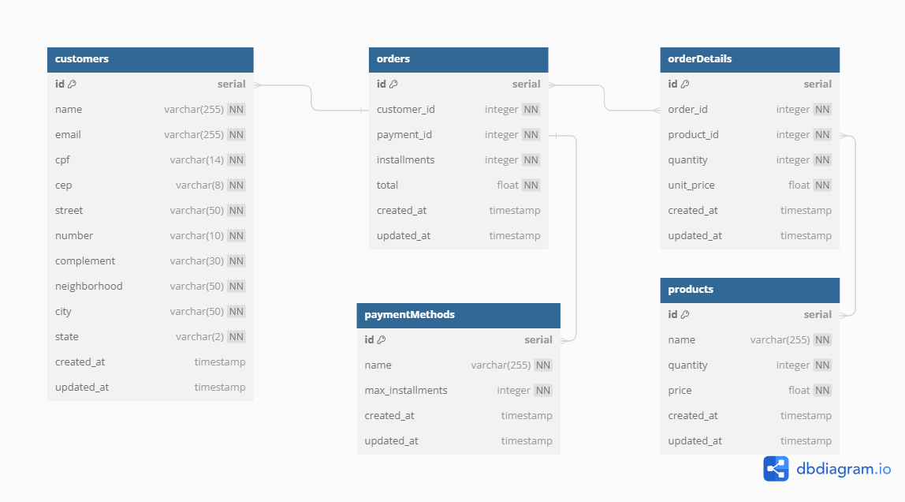

<p align=center>
    
</p>

# Introdução

O sistema proporciona um ambiente completo para o gerenciamento de comércio, abrangendo clientes, produtos, métodos de pagamento e vendas. Com foco na simplificação das operações diárias, como controle de estoque, processamento de vendas e gestão de clientes, busca-se otimizar os processos comerciais de forma eficaz.

## Dependências do sistema

- [Docker](https://docs.docker.com/desktop/install/windows-install/)

## Tecnologias e técnicas utilizadas

### Back-end

- **Linguagem:** PHP
- **Banco de Dados:** PostgreSQL
- **Testes Unitários:** PHPUnit

### Front-end

- **Framework/Linguagem:** Vue JS

## Modelagem da base de dados PostgreSQL

Antes do início do projeto, foi elaborada a modelagem utilizando o [dbdiagram.io](https://dbdiagram.io/).

A imagem abaixo proporciona uma perspectiva geral da estrutura do banco de dados integrado ao sistema.

<p align=center>
    
</p>

## Setup Docker

### Clone o projeto

```bash
cd "caminho/da/sua/pasta"
git clone https://github.com/CarolineSampaio/teste-tecnico-zucchetti.git
cd "teste-tecnico-zucchetti"
code ./ #Abrirá o Vscode na raiz do projeto
```

### Configure o ambiente

### Back-end

Para garantir o correto funcionamento do back-end, execute os seguintes comandos:

```bash
cd backend
composer install
```

### Front-end

Para garantir o correto funcionamento do front-end, retorne para a pasta raiz e execute os seguintes comandos:

```bash
cd .. #retornando para a raiz
cd frontend
npm install
```

### Docker

O comando abaixo deve ser executado na raiz "teste-tecnico-zucchetti". O mesmo criará as imagens necessárias, configurará o banco de dados da aplicação e o de testes, executará os seeders para preenchimento inicial de dados, e inicializará tanto o servidor frontend quanto o back-end.

```sh
cd .. #retornando para a raiz
docker compose up  # para rodar em background adicione -d
```

## Acessando a aplicação

Após a configuração do ambiente, ambos os servidores já estão ativos e prontos para serem acessados:

### Front-end

Link: `http://localhost:5173/`

### Back-end

Base URL: `http://localhost/`

## Rodando testes

### Back-end

O banco de dados para teste foi configurado no docker, por isso, após configurar o ambiente (docker compose up) basta executar:

```bash
composer install
composer test
```

## Melhorias

- [x] **Dockerizar a aplicação/ambiente de desenvolvimento:** Implementar o uso de Docker para simplificar o ambiente de desenvolvimento e garantir consistência entre diferentes máquinas.

- [x] **Utilizar a cláusula FOR UPDATE nas consultas SQL** Adotar a cláusula FOR UPDATE em consultas SQL para controlar a concorrência em operações de atualização de dados no banco de dados.

- [x] **Implementar testes unitários no back-end:** Desenvolver testes automatizados para verificar o comportamento de unidades de código no back-end, aumentando a confiabilidade e a robustez do sistema.

- **Implementar testes unitários no front-end:** Desenvolver testes automatizados para verificar o comportamento de unidades de código no front-end, garantindo o correto funcionamento da interface.

- **Autenticação:** Introduzir um sistema de autenticação robusto e seguro para controlar o acesso aos recursos da aplicação, garantindo a proteção dos dados e a segurança das operações realizadas pelos usuários.

- **Aprimorar o roteamento backend:** Simplificar e organizar o gerenciamento de rotas, melhorando a estrutura e facilitando a adição de novas rotas para uma arquitetura mais robusta e escalável.

- **Implementar cache para cliente, produto e forma de pagamento:** Desenvolver e implementar uma estratégia de cache eficiente para armazenar informações de clientes, produtos e formas de pagamento, visando melhorar o desempenho e a escalabilidade da aplicação, reduzindo a carga no banco de dados e otimizando o tempo de resposta das consultas.

- **Otimizar consultas ao banco de dados:** Aprimorar a eficiência das consultas SQL, utilizando técnicas como inserção em massa (bulk insert) e seleção otimizada (O método de atualização de estoque do produto possui complexidade de O(2N) mas pode rodar em O(2) agrupando queries).

- **Permitir edição de produtos e quantidades durante o processo de atualização de uma venda:** Implementar funcionalidades que permitam a edição de produtos e quantidades durante o processo de atualização de uma venda, oferecendo maior flexibilidade e controle aos usuários.

- **Implementar um sistema para controle de status da venda:** Desenvolver um sistema de máquina de estados finitos para controlar o status das vendas, proporcionando uma melhor organização e rastreamento do processo da venda.

- **Reforçar as validações de dados no back-end e front-end:** Fortalecer as validações de dados tanto no lado do servidor quanto no lado do cliente, garantindo uma maior integridade e consistência dos dados manipulados pela aplicação.

- **Aprimorar as respostas do back-end para incluir objetos estruturados de dados:** Melhorar as respostas do back-end para incluir objetos estruturados de dados em vez de mensagens simples, oferecendo mais informações e contexto aos clientes da API.

- **Adotar PSR-4 Imports para estruturação e importação de classes PHP:** Seguir o padrão PSR-4 para a estruturação e importação de classes PHP, garantindo uma organização clara e consistente do código.

## Documentação da API

Esta documentação descreve os endpoints disponíveis para interagir com a API de gerenciamento.

Base URL: `http://localhost/`

## Endpoints

## Clientes

### Listar Clientes

Retorna uma lista de todos os clientes cadastrados.

- **Método:** GET
- **Endpoint:** `/customers`
- **Resposta de Sucesso:** Status 200 OK
- **Exemplo de Resposta:**
  ```json
  [
    {
      "id": 1,
      "name": "João",
      "email": "joao@example.com",
      "cpf": "123.456.789-00",
      "cep": "12345678",
      "street": "Main Street",
      "number": "123",
      "complement": "Apartment 101",
      "neighborhood": "Central",
      "city": "Big City",
      "state": "BC"
    }
  ]
  ```

### Criar Cliente

Cria um novo cliente.

- **Método:** POST
- **Endpoint:** `/customers`
- **Corpo da Requisição:**
  ```json
  {
    "name": "Nome do Cliente",
    "email": "cliente@example.com",
    "cpf": "123.456.789-00",
    "cep": "12345678",
    "street": "Nome da Rua",
    "number": "123",
    "complement": "Complemento",
    "neighborhood": "Bairro",
    "city": "Cidade",
    "state": "Estado"
  }
  ```
- **Resposta de Sucesso:** Status 201 Created
- **Exemplo de Resposta:**
  ```json
  {
    "message": "Registered successfully"
  }
  ```

### Obter Cliente

Retorna os detalhes de um cliente específico com base no ID fornecido.

- **Método:** GET
- **Endpoint:** `/customers?id={id}`
- **Resposta de Sucesso:** Status 200 OK
- **Exemplo de Resposta:**
  ```json
  {
    "id": 1,
    "name": "João",
    "email": "joao@example.com",
    "cpf": "123.456.789-00",
    "cep": "12345678",
    "street": "Main Street",
    "number": "123",
    "complement": "Apartment 101",
    "neighborhood": "Central",
    "city": "Big City",
    "state": "BC"
  }
  ```

### Atualizar Cliente

Atualiza os detalhes de um cliente já cadastrado.

- **Método:** PUT
- **Endpoint:** `/customers?id={id}`
- **Corpo da Requisição:**
  ```json
  {
    "email": "novoemail@example.com"
  }
  ```
- **Resposta de Sucesso:** Status 200 OK
- **Exemplo de Resposta:**
  ```json
  {
    "message": "Customer updated"
  }
  ```

### Excluir Cliente

Exclui um cliente existente pelo ID.

- **Método:** DELETE
- **Endpoint:** `/customers?id={id}`
- **Resposta de Sucesso:** Status 204 No Content

---

## Produtos

### Listar Produtos

Retorna uma lista de todos os produtos cadastrados.

- **Método:** GET
- **Endpoint:** `/products`
- **Resposta de Sucesso:** Status 200 OK
- **Exemplo de Resposta:**
  ```json
  [
    {
      "id": 1,
      "name": "produto3",
      "price": 10.1,
      "quantity": 50
    }
  ]
  ```

### Criar Produto

Cria um novo produto.

- **Método:** POST
- **Endpoint:** `/products`
- **Corpo da Requisição:**
  ```json
  {
    "name": "Nome do Produto",
    "price": 10.1,
    "quantity": 50
  }
  ```
- **Resposta de Sucesso:** Status 201 Created
- **Exemplo de Resposta:**
  ```json
  {
    "message": "Registered successfully"
  }
  ```

### Obter Produto

Obtém detalhes de um produto específico pelo ID.

- **Método:** GET
- **Endpoint:** `/products?id={id}`
- **Resposta de Sucesso:** Status 200 OK
- **Exemplo de Resposta:**
  ```json
  {
    "id": 1,
    "name": "produto3",
    "price": 10.1,
    "quantity": 50
  }
  ```

### Atualizar Produto

Atualiza os detalhes de um produto existente.

- **Método:** PUT
- **Endpoint:** `/products?id={id}`
- **Corpo da Requisição:**
  ```json
  {
    "name": "Novo Nome do Produto"
  }
  ```
- **Resposta de Sucesso:** Status 200 OK
- **Exemplo de Resposta:**
  ```json
  {
    "message": "Product updated"
  }
  ```

### Excluir Produto

Exclui um produto existente pelo ID.

- **Método:** DELETE
- **Endpoint:** `/products?id={id}`
- **Resposta de Sucesso:** Status 204 No Content

---

## Métodos de Pagamento

### Listar Métodos de Pagamento

Retorna uma lista de todos os métodos de pagamento cadastrados.

- **Método:** GET
- **Endpoint:** `/payments`
- **Resposta de Sucesso:** Status 200 OK
- **Exemplo de Resposta:**
  ```json
  [
    {
      "id": 1,
      "name": "credit_card",
      "max_installments": 12
    }
  ]
  ```

### Criar Método de Pagamento

Cria um novo método de pagamento.

- **Método:** POST
- **Endpoint:** `/payments`
- **Corpo da Requisição:**
  ```json
  {
    "name": "Nome do Método de Pagamento",
    "max_installments": 12
  }
  ```
- **Resposta de Sucesso:** Status 201 Created
- **Exemplo de Resposta:**
  ```json
  {
    "message": "Registered successfully"
  }
  ```

### Obter Método de Pagamento

Retorna os detalhes de um método de pagamento com base no ID fornecido.

- **Método:** GET
- **Endpoint:** `/payments?id={id}`
- **Resposta de Sucesso:** Status 200 OK
- **Exemplo de Resposta:**
  ```json
  {
    "id": 1,
    "name": "credit_card",
    "max_installments": 12
  }
  ```

### Atualizar Método de Pagamento

Atualiza os detalhes de um método de pagamento existente.

- **Método:** PUT
- **Endpoint:** `/payments?id={id}`
- **Corpo da Requisição:**
  ```json
  {
    "name": "Novo Nome do Método de Pagamento"
  }
  ```
- **Resposta de Sucesso:** Status 200 OK
- **Exemplo de Resposta:**
  ```json
  {
    "message": "Payment method updated"
  }
  ```

### Excluir Método de Pagamento

Exclui um método de pagamento existente pelo ID.

- **Método:** DELETE
- **Endpoint:** `/payments?id={id}`
- **Resposta de Sucesso:** Status 204 No Content

---

## Vendas

### Listar Vendas

Retorna uma lista de todas as vendas cadastradas.

- **Método:** GET
- **Endpoint:** `/orders`
- **Resposta de Sucesso:** Status 200 OK
- **Exemplo de Resposta:**
  ```json
  [
    {
      "order_id": 1,
      "customer_id": 1,
      "customer_name": "João Silva",
      "payment_id": 1,
      "payment_method": "credit card",
      "installments": 2,
      "total": "75",
      "products": [
        {
          "product_id": 1,
          "product_name": "Produto A",
          "quantity": 2,
          "unit_price": "25"
        },
        {
          "product_id": 2,
          "product_name": "Produto B",
          "quantity": 1,
          "unit_price": "25"
        }
      ]
    }
  ]
  ```

### Criar venda

Cria uma nova venda.

- **Método:** POST
- **Endpoint:** `/orders`
- **Corpo da Requisição:**
  ```json
  {
    "customer_id": 1,
    "payment_id": 1,
    "installments": 5,
    "products": [
      {
        "product_id": 1,
        "quantity": 10
      }
    ]
  }
  ```
- **Resposta de Sucesso:** Status 201 Created
- **Exemplo de Resposta:**
  ```json
  {
    "message": "Registered successfully"
  }
  ```

### Obter venda

Obtém detalhes de uma venda específica pelo ID.

- **Método:** GET
- **Endpoint:** `/orders?id={id}`
- **Resposta de Sucesso:** Status 200 OK
- **Exemplo de Resposta:**
  ```json
  {
    "order_id": 1,
    "customer_id": 1,
    "customer_name": "João Silva",
    "payment_id": 1,
    "payment_method": "credit card",
    "installments": 2,
    "total": "75",
    "products": [
      {
        "product_id": 1,
        "product_name": "Produto A",
        "quantity": 2,
        "unit_price": "25"
      },
      {
        "product_id": 2,
        "product_name": "Produto B",
        "quantity": 1,
        "unit_price": "25"
      }
    ]
  }
  ```

### Obter vendas com ID do Cliente

Obtém detalhes de todas as vendas de um cliente específico com base no ID do cliente.

- **Método:** GET
- **Endpoint:** `/orders?customer_id={customer_id}`
- **Resposta de Sucesso:** Status 200 OK
- **Exemplo de Resposta:**
  ```json
  [
    {
      "order_id": 1,
      "customer_id": 1,
      "customer_name": "João Silva",
      "payment_id": 1,
      "payment_method": "credit card",
      "installments": 2,
      "total": "75",
      "products": [
        {
          "product_id": 1,
          "product_name": "Produto A",
          "quantity": 2,
          "unit_price": "25"
        },
        {
          "product_id": 2,
          "product_name": "Produto B",
          "quantity": 1,
          "unit_price": "25"
        }
      ]
    }
  ]
  ```

### Atualizar venda

Atualiza os detalhes de uma venda existente.

- **Método:** PUT
- **Endpoint:** `/orders?id={id}`
- **Corpo da Requisição:**
  ```json
  {
    "payment_id": 2,
    "installments": 1
  }
  ```
- **Resposta de Sucesso:** Status 200 OK
- **Exemplo de Resposta:**
  ```json
  {
    "message": "Order updated"
  }
  ```

### Excluir venda

Exclui uma venda existente pelo ID.

- **Método:** DELETE
- **Endpoint:** `/orders?id={id}`
- **Resposta de Sucesso:** Status 204 No Content

---
